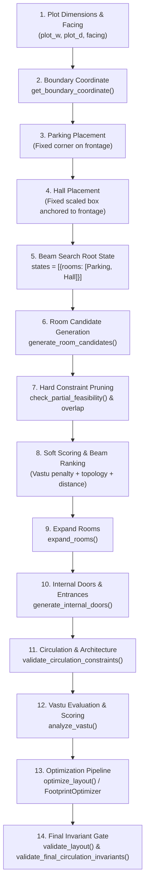
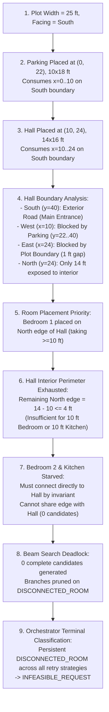

# PHASE 4A — ADAPTIVE LAYOUT STRATEGY INVESTIGATION
**Indian AI Floor Plan Generator**  
**Date:** October 2026  
**Repository Baseline:** `https://github.com/Sabarish370/floorplan_ai.git`  
**Git Baseline Commit:** `4931cd305c09103f1a118f8057d8ead6e8c11e6d` (`tag: phase-3h-stable-baseline`)  
**Investigation Scope:** Read-Only Architectural Investigation & Topology Diagnostics  

---

## 1. Executive Summary

This report delivers a comprehensive investigation into the geometric and topological mechanisms that govern layout generation across different plot dimensions and orientations in the Indian AI Floor Plan Generator. Using empirical evidence from the 26 controlled scenarios of the Phase 3H robustness evaluation (`reports/phase3h_robustness.json`) and source-code trace of the production pipeline, this study reveals the precise mathematical cause of structural infeasibility on narrow plots (such as 25x40 South-facing) and why identical or larger plots succeed under different orientations (such as 25x40 West-facing or 40x50 East-facing).

### Key Empirical Findings
1. **The Root Bottleneck is Fixed-Root Perimeter Starvation:**
   In `generate_layout_beam_search()` (`layout/generator.py`), Parking and Hall are treated as rigid, immutable root nodes placed deterministically at step 1 via `generate_layout(reqs, seed=42, strategy='baseline')`. The generator explores subsequent room combinations, but **explores zero topological alternatives for the Parking + Hall root arrangement**.
2. **Narrow Frontage Chokehold on South/North Plots:**
   On a 25 ft wide plot with South facing, the entire road frontage is only 25 ft. Parking consumes 10 ft of this frontage (`x=0..10, y=22..40`). Hall consumes 14 ft (`x=10..24, y=24..40`). Hall's South side is exterior road frontage; its West side is blocked by Parking; its East side has only 1 ft to the plot boundary. Consequently, **only Hall's North side (14 ft) is accessible for interior circulation**.
3. **Mathematical Access Invariant Failure:**
   The architectural rules strictly mandate:
   - Every Bedroom must connect directly to Hall (`min_width >= 10 ft`).
   - The primary Kitchen must connect directly to Hall (`min_width >= 8-10 ft`).
   - Common bathrooms cannot pass through bedrooms.
   For a 2BHK+Kitchen program, these three rooms require a minimum combined shared edge with Hall of $10 + 10 + 8 = 28\text{ ft}$. Because Hall provides only 14 ft of interior edge, placing Bedroom 1 along that edge immediately leaves $\le 4\text{ ft}$, permanently starving Bedroom 2 and Kitchen.
4. **Why West-Facing 25x40 Succeeds (`Facing-West = VALID`):**
   When facing West, the frontage is along the **40 ft depth axis** ($y=0..40$) rather than the 25 ft width axis. Parking takes 18 ft along the West edge, leaving 22 ft of frontage. Hall takes 16 ft along the West edge, directly touching the road with 6 ft to spare. Behind Parking and Hall, across the 25 ft plot width, large uninterrupted rectangular zones remain open on Hall's East (16 ft) and South (14 ft) edges, easily accommodating Bedroom 1, Bedroom 2, and Kitchen simultaneously.
5. **No Algorithmic or Vastu Corruption:**
   Vastu was proven completely orthogonal to this failure: disabling Vastu (`Vastu-OFF`) yields the identical `INFEASIBLE_REQUEST` with 0 complete candidates. The issue is purely geometric and topological.

---

## 2. Current Layout Pipeline Trace

The actual execution sequence implemented in the production engine proceeds as follows:



### Detailed Operational Stages

1. **Plot Dimensions & Facing:**
   `FloorPlanRequirements` defines `plot.width`, `plot.depth`, `plot.facing` (`models/requirements.py`).
2. **Facing Boundary Determination:**
   `layout/orientation.py` maps facing to coordinate axes:
   - `North`: axis `y`, target coordinate $0.0$.
   - `South`: axis `y`, target coordinate `plot_depth`.
   - `West`: axis `x`, target coordinate $0.0$.
   - `East`: axis `x`, target coordinate `plot_width`.
3. **Parking Placement (`layout/generator.py:66-83`):**
   If `reqs.parking` is requested, `ROOM_DIMENSIONS['parking']` provides `pref_width=10`, `pref_depth=18`. Parking is anchored to the origin corner of the frontage boundary:
   - If axis `y`: placed at `x=0, y=target_val - d` (for South: `x=0, y=plot_depth - 18`).
   - If axis `x`: placed at `x=target_val - w, y=0` (for West: `x=0, y=0`).
4. **Hall Sizing & Dimensioning (`layout/generator.py:86-118`):**
   Hall dimensions are calculated using a square-root plot area scale factor:
   $$\text{scale} = \sqrt{\frac{\text{plot\_area}}{1200.0}}$$
   If parking exists and axis is `y`:
   $$w = \text{plot\_w} - \text{pr\_w} = 25 - 10 = 15.0 \implies \text{clamped to } 14.0\text{ ft}$$
   $$d = \max(16.0, \text{round}(16.0 \cdot \text{scale} / 2) \cdot 2) \implies 16.0\text{ ft}$$
5. **Hall Frontage Anchoring (`layout/generator.py:120-184`):**
   Candidate positions for Hall are scanned along the frontage boundary. The candidate minimizing distance to the exterior road edge (`road_dist * 100 + offset`) without intersecting Parking is selected. On 25x40 South, this forces Hall to `x=10.0, y=24.0, w=14.0, d=16.0`.
6. **Root State Initialization (`layout/generator.py:647-654`):**
   `generate_layout_beam_search()` calls `base_plan = generate_layout(reqs, seed=42, strategy='baseline')` and extracts Parking and Hall. `states = [{'rooms': [Parking, Hall], 'score': (0,0,0,0)}]`.
7. **Room Candidate Generation (`layout/generator.py:333-553`):**
   For each room in priority order (e.g. `['bedroom', 'kitchen', 'pooja', 'bathroom']`):
   - Allowed parent rooms are identified (e.g., for Bedroom: `parent_rooms = [Hall]`; for Bathroom: `[Hall] + [Bedrooms without bath]`).
   - Slices of standard room sizes are tested adjacent to parent rooms in 4 cardinal directions (North, South, East, West).
8. **Candidate Filtering & Hard Pruning (`layout/generator.py:480-532, 695-733`):**
   - Candidate overlaps with existing rooms are pruned.
   - `check_partial_feasibility()` verifies remaining area and tests BFS graph connectivity from Hall to all placed rooms.
   - **Hard Invariant:** `if r_type.startswith('bedroom') and not connected_to_hall: continue`.
   - **Hard Invariant:** `if r_type.startswith('kitchen') and not connected_to_hall: continue` (unless secondary kitchen).
9. **Beam Search Pruning (`layout/generator.py:756-765`):**
   Surviving partial states are ranked lexicographically by:
   `score = (disconnected_flag, topological_penalty + vastu_penalty, vastu_penalty, distance_penalty)`.
   The top `beam_width=15` states are retained. If `next_states` is empty, beam search aborts and returns `[]`.
10. **Room Expansion (`layout/expansion.py:expand_rooms`):**
    Rooms are iteratively nudged outward by `step=0.5` to claim adjacent open space without exceeding aspect-ratio bounds ($<2.0$ for rooms, $<2.5$ for hall/bath).
11. **Door & Entrance Generation (`layout/doors.py`, `layout/entrance.py`):**
    - `create_main_entrance()` places the main entry door on the exterior facing boundary of Hall.
    - `create_vehicle_gate()` places the exterior vehicular gate on Parking.
    - `generate_internal_doors()` executes Prim's spanning tree algorithm starting from Hall, prioritizing public-to-private edges with edge length tie-breaking.
12. **Circulation & Architectural Validation (`layout/architecture.py`):**
    `validate_circulation_constraints()` verifies reachability via NetworkX, rejecting plans where bedrooms or kitchens are used as pass-through circulation.
13. **Vastu Evaluation (`vastu/validator.py:analyze_vastu`):**
    Calculates zone coverage across the 9 Vastu quadrants and outputs score (0–100) and penalties.
14. **Optimization Layer (`layout/footprint_optimizer.py`, `layout/vastu_optimizer.py`):**
    Iteratively ranks candidates and applies issue-driven optimizers if triggered.
15. **Final Validation Gate (`layout/validator.py:validate_layout`):**
    Validates boundary containment, polygon intersections, exterior connectivity, and absence of isolated rooms.

---

## 3. Hall Frontage Analysis

Hall positioning is the single most critical structural variable in the generator.

| Question | Current Implementation Finding | Source Reference |
| :--- | :--- | :--- |
| **How is hall_1 positioned?** | Deterministically placed along the exterior boundary facing the road, immediately adjacent to Parking if parking exists. | `layout/generator.py:120-184` |
| **Is Hall placement aware of facing?** | Yes. It queries `get_boundary_coordinate(facing_norm, plot_w, plot_d)` to identify the primary axis and frontage coordinate. | `layout/generator.py:92-94` |
| **Is Hall placement aware of main entrance?** | Yes. It minimizes `road_dist = abs(coord - target_val)` so Hall's outer edge touches the exterior boundary where `create_main_entrance()` will be placed. | `layout/generator.py:133-148` |
| **How much of Hall boundary is exterior?** | Typically 1 full side (14 to 20 ft). For South-facing 25x40: exactly 14 ft along the South boundary ($y=40, x=10..24$). | `layout/generator.py:116-117` |
| **Can another room occupy frontage between Hall and exterior?** | No. The distance formula penalizes non-frontage placement by multiplying interior offset by 100 (`road_dist * 100`). | `layout/generator.py:134, 148` |
| **Does parking consume frontage before Hall?** | **Yes, always.** Parking is placed at Step 3; Hall is placed at Step 4. Parking claims its full width (10 ft) or depth (18 ft) on the frontage before Hall is considered. | `layout/generator.py:65-83, 85-184` |
| **Is Hall placement deterministic?** | Yes. When `seed == 0` (or `seed == 42` in beam search baseline), Hall placement is 100% deterministic with zero jitter. | `layout/generator.py:173` |
| **Does candidate generation produce multiple Hall topologies?** | **No.** Hall is placed once. All beam search iterations take `initial_rooms` directly from this single layout. | `layout/generator.py:649-650` |
| **Can Hall move horizontally/vertically?** | No. It is anchored to the frontage. On 25x40 South, the search space for Hall has exactly 1 valid candidate ($x=10, y=24$). | `layout/generator.py:130-150` |
| **What constraints prevent Hall from direct frontage?** | None; Hall is mandated to touch the frontage. However, on narrow plots, Parking pre-empts 40% of the frontage, compressing Hall into the remaining corner. | `layout/generator.py:99-106` |

---

## 4. Parking Interaction Analysis

1. **Placement Timing:**
   Parking is placed in Step 3, before Hall, before any other room, and before any candidate search begins (`layout/generator.py:65-84`).
2. **Frontage Anchor:**
   Parking is rigidly anchored to coordinate $(0, 0)$ or $(0, \text{plot\_depth} - d)$ on the road frontage. It never moves into the interior.
3. **Frontage Competition with Hall:**
   On narrow plots, Parking directly competes for the same finite linear boundary that Hall requires.
   - On a 25 ft frontage, Parking occupies $10\text{ ft}$ ($40\%$).
   - Hall requires at least $12\text{ ft}$ (preferably $14\text{ ft}$).
   - Together, Parking ($10\text{ ft}$) + Hall ($14\text{ ft}$) = $24\text{ ft}$ out of $25\text{ ft}$.
   - Only $1\text{ ft}$ remains unused.
4. **Mobility and Alternatives:**
   Parking cannot move to another frontage position (e.g. the right corner or a recessed setback). Its placement logic contains no alternative branch:
   ```python
   if axis == 'x':
       best_pos = (target_val - w if target_val > 0 else 0, 0, w, d)
   else:
       best_pos = (0, target_val - d if target_val > 0 else 0, w, d)
   ```
5. **Impact of Removing Parking:**
   When `parking = False`, the entire 25 ft frontage becomes available. Hall is placed freely, leaving both sides exposed. In Phase 3H robustness testing, `Parking-No` on 25x40 South succeeded with `VALID` status (`reports/phase3h_robustness.json:43-48`). This proves Parking frontage consumption is a necessary link in the infeasibility chain.
6. **Hard vs Preference:**
   Parking placement is treated as an immutable hard geometric constraint.

---

## 5. Trace of the 25x40 South Infeasibility Chain

The Phase 3H stress case evaluated the following specification:
- **Plot:** 25 x 40 ft, Facing South
- **Rooms:** 2 Bedrooms, 1 Hall, 1 Kitchen, 2 Bathrooms, 1 Pooja, Parking
- **Agentic Outcome:** `INFEASIBLE_REQUEST` (0 complete candidates, 0 invalid renders)

### Step-by-Step Mathematical Proof of the Failure Chain



#### Detailed Proof Steps:
1. **Frontage Exhaustion:**
   Frontage is along $y=40$. Plot width is $x \in [0, 25]$.
   Parking occupies $x \in [0, 10], y \in [22, 40]$.
   Hall occupies $x \in [10, 24], y \in [24, 40]$.
2. **Hall Perimeter Enclosure:**
   - **South Edge ($y=40, x \in [10, 24]$):** Frontage boundary. Touches exterior road. Dedicated to Main Entrance. Cannot parent interior private rooms without violating exterior wall integrity.
   - **West Edge ($x=10, y \in [24, 40]$):** Shares edge with Parking ($x \in [0, 10], y \in [22, 40]$). Invariant in `layout/validator.py:101-102` strictly forbids interior room doors connecting through Parking.
   - **East Edge ($x=24, y \in [24, 40]$):** Distance to plot boundary is $25 - 24 = 1.0\text{ ft}$. No room can fit in a 1 ft strip.
   - **North Edge ($y=24, x \in [10, 24]$):** Length is exactly $14.0\text{ ft}$. **This is the ONLY accessible interior boundary of Hall.**
3. **Demand vs Supply Imbalance:**
   - Invariant `layout/generator.py:517`: `if r_type.startswith('bedroom') and not connected_to_hall: continue`
   - Invariant `layout/generator.py:521`: `if r_type.startswith('kitchen') and not connected_to_hall: continue`
   - Min Bedroom width = 10 ft; Min Kitchen width = 8–10 ft.
   - Required shared boundary on Hall:
     $$\text{Demand} = \text{Width}(\text{Bed}_1) + \text{Width}(\text{Bed}_2) + \text{Width}(\text{Kit}) \ge 10 + 10 + 8 = 28\text{ ft}$$
     $$\text{Available Supply} = 14\text{ ft}$$
     $$\text{Deficit} = 28 - 14 = 14\text{ ft}$$
4. **Deadlock in Beam Search:**
   When Bedroom 1 is placed at $x=10..22, y=12..24$, it consumes 12 ft of Hall's 14 ft North edge. The remaining North edge is $14 - 12 = 2.0\text{ ft}$.
   Minimum door width is $3.0\text{ ft}$. Neither Bedroom 2 nor Kitchen can achieve a $\ge 3.0\text{ ft}$ shared edge with Hall.
   The generator prunes all candidate positions for Bedroom 2 and Kitchen with `connected_to_hall == False`.
   Search nodes reach 0; beam search logs:
   `[BEAM DEAD] Room 'bedroom' produced 0 next_states`.
5. **Classification:**
   The Agentic Orchestrator retries across all strategies (`vastu_first`, `kitchen_first`, `bedroom_first`, `balanced`, `baseline`). All 5 produce 0 complete candidates due to `DISCONNECTED_ROOM`. The orchestrator conservatively classifies the case as `INFEASIBLE_REQUEST`.

---

## 6. Comparison: 25x40 South (Infeasible) vs Successful Baselines

| Parameter | 25x40 South (Failed) | 25x40 West (Valid) | 40x50 East (TC2 - Valid) | 30x50 North (TC3 - Valid) |
| :--- | :--- | :--- | :--- | :--- |
| **Plot Width x Depth** | 25 x 40 ft | 25 x 40 ft | 40 x 50 ft | 30 x 50 ft |
| **Facing** | South | West | East | North |
| **Frontage Dimension** | **25 ft (Choked)** | **40 ft (Ample)** | **50 ft (Ample)** | **30 ft (Adequate)** |
| **Frontage Axis** | $y = 40$ | $x = 0$ | $x = 40$ | $y = 0$ |
| **Parking Footprint** | $10 \times 18\text{ ft}$ at $(0, 22)$ | $10 \times 18\text{ ft}$ at $(0, 0)$ | $10 \times 18\text{ ft}$ at $(30, 0)$ | $10 \times 18\text{ ft}$ at $(0, 0)$ |
| **Frontage Eaten by Parking** | $10\text{ ft}$ ($40\%$) | $18\text{ ft}$ ($45\%$) | $18\text{ ft}$ ($36\%$) | $10\text{ ft}$ ($33\%$) |
| **Remaining Frontage for Hall** | $15\text{ ft}$ | $22\text{ ft}$ | $32\text{ ft}$ | $20\text{ ft}$ |
| **Hall Dimensions ($w \times d$)** | $14 \times 16\text{ ft}$ | $14 \times 16\text{ ft}$ | $24 \times 22\text{ ft}$ | $20 \times 22\text{ ft}$ |
| **Hall Location** | $(10, 24)$ | $(0, 18)$ | $(16, 18)$ | $(10, 0)$ |
| **Hall Interior Accessible Edge** | **14 ft (North only)** | **30 ft (East 16' + South 14')**| **46 ft (North 24' + West 22')**| **24 ft (South 20' + West 4')**|
| **Total Room Count** | 7 (2B, 1H, 1K, 2Bth, 1P) | 7 (2B, 1H, 1K, 2Bth, 1P) | 7 (3B, 1H, 1K, 2Bth, 0P) | 7 (2B, 1H, 2K, 1Bth, 1P) |
| **Direct Access Demand** | $28\text{ ft}$ | $28\text{ ft}$ | $30\text{ ft}$ | $20\text{ ft}$ (Kitchen parents Kit2) |
| **Perimeter Margin** | **$-14\text{ ft}$ (Deficit)** | **$+2\text{ ft}$ (Surplus)** | **$+16\text{ ft}$ (Surplus)** | **$+4\text{ ft}$ (Surplus)** |
| **Complete Candidates** | **0** | **4** | **61** | **61** |
| **Outcome** | `INFEASIBLE_REQUEST` | `VALID` | `VALID` | `VALID` |

---

## 7. Facing Direction Sensitivity Analysis

On the identical 25x40 plot with identical full room program (2B, 1H, 1K, 2Bath, 1Pooja, Parking), the Phase 3H robustness report revealed a stark dichotomy:

- `Facing-South`: **INFEASIBLE_REQUEST** (0 complete candidates, `kitchen_1` / `bathroom_2` disconnected)
- `Facing-North`: **INFEASIBLE_REQUEST** (0 complete candidates, `kitchen_1` / `bathroom_2` disconnected)
- `Facing-East`: **INFEASIBLE_REQUEST** (0 complete candidates, `bathroom_1` / `kitchen_1` disconnected)
- `Facing-West`: **VALID** (Generated valid layout, architecture score 97.0, utilization 76.6%)

### Why Does West Succeed While East, South, and North Fail?

1. **South and North are Width-Frontage Plots ($25\text{ ft}$):**
   - Frontage is strictly 25 ft.
   - Parking ($10\text{ ft}$) and Hall ($14\text{ ft}$) span $24\text{ ft}$, pinning Hall against the boundary and leaving only its inner horizontal edge (14 ft) exposed.
2. **East and West are Depth-Frontage Plots ($40\text{ ft}$):**
   - Frontage is along the 40 ft depth axis ($y \in [0, 40]$).
   - Parking consumes 18 ft along $y$; Hall consumes 16 ft along $y$.
   - Together they consume $18 + 16 = 34\text{ ft}$ out of $40\text{ ft}$, leaving $6\text{ ft}$ of frontage to spare.
   - Both Parking and Hall comfortably sit on the road frontage.
3. **Why West Succeeds but East Fails on 25x40:**
   - **West Facing:** Road is on West ($x=0$). Parking is at $(0, 0)$. Hall is at $(0, 18, 14, 16)$.
     Behind Parking ($x \in [10, 25], y \in [0, 18]$) is a large open rectangle ($15 \times 18\text{ ft}$) that touches the East wall of Hall.
     To the South of Hall ($x \in [0, 14], y \in [34, 40]$) is an open area ($14 \times 6\text{ ft}$).
     To the East of Hall ($x \in [14, 25], y \in [18, 34]$) is an open area ($11 \times 16\text{ ft}$).
     Hall exposes **30 ft of interior perimeter** (16 ft on East + 14 ft on South). Bedroom 1 and Kitchen attach easily to the East and North/South edges.
   - **East Facing:** Road is on East ($x=25$). Parking is placed at $(15, 0, 10, 18)$. Hall is placed at $(11, 18, 14, 16)$.
     Under Indian Vastu rules, the **South-East (SE) zone is strictly designated for Kitchen** (`Agni` corner).
     In 25x40 East, Hall is forced into coordinates $x \in [11, 25], y \in [18, 34]$, directly swallowing the South-East quadrant.
     Kitchen candidates in their preferred SE zone overlap with Hall. When Kitchen candidates are forced into alternative zones, they cannot satisfy direct Hall connectivity while avoiding bathroom zones. The compound constraint of Vastu zone avoidance + 11 ft remaining width causes East to deadlock.

---

## 8. Latent Topology and Search Branch Analysis

To determine whether the existing codebase contains latent topological flexibility, we analyzed `layout/generator.py`, `layout/vastu_optimizer.py`, and `agents/orchestrator.py`:

| Component | Explores Dimensional Variants? | Explores Topological Variants? | Findings |
| :--- | :---: | :---: | :--- |
| **Parking Placement** | No | **No** | Hardcoded to corner $(0, 0)$ or $(0, \text{plot\_depth} - d)$. No alternate corners tested. |
| **Hall Placement** | Slight ($14 \times 16$ vs $14 \times 20$) | **No** | Anchored to first valid frontage candidate. Never tested in elongated or central orientations. |
| **Room Sizing** | Yes ($10 \times 12, 12 \times 14, 14 \times 14$) | No | Evaluates 4–7 dimensional tuples per room type. |
| **Room Ordering** | No | Yes (5 strategies) | Tests `vastu_first`, `kitchen_first`, `bedroom_first`, `balanced`, `baseline`. |
| **Parent Adjacency** | No | Rigid | Bedroom $\to$ Hall (mandatory); Kitchen $\to$ Hall (mandatory); Bath $\to$ Hall or Bedroom. |
| **Beam Search** | Yes | Only for secondary rooms | Expands around the fixed Parking+Hall root. Does not branch on root topology. |

**Conclusion:**
The generator does **not** explore meaningful topological alternatives. It runs a deep search over secondary room placement, but that search is rooted in an **immutable, single-point Parking+Hall foundation**. If that root foundation starves the interior perimeter, 100% of downstream beam search branches are guaranteed to die.

---

## 9. Candidate Phase 4 Strategies

Based strictly on the diagnostic evidence, we present four potential Phase 4 strategies:

```mermaid
graph TD
    subgraph Strategy_A ["Strategy A: Adaptive Hall Aspect Ratio & Depth Inversion"]
        A1["Trigger: Plot Width < 30 ft & Parking = True"] --> A2["Orient Hall with Depth along plot length<br/>w=12 ft, d=20-22 ft"]
        A2 --> A3["Increases North-South interior boundary by +6 to +8 ft"]
    end

    subgraph Strategy_B ["Strategy B: Dual-Corner Parking & Frontage Stagger"]
        B1["Trigger: Choked frontage (remaining frontage < 15 ft)"] --> B2["Evaluate Parking on opposite corner or tandem offset"]
        B2 --> B3["Frees continuous frontage for Hall"]
    end

    subgraph Strategy_C ["Strategy C: Foyer / Circulation Node Anchor"]
        C1["Trigger: Direct access demand > Available Hall perimeter"] --> C2["Place 6x8 ft Central Foyer/Circulation Node touching Hall"]
        C2 --> C3["Foyer acts as secondary public parent for 2 rooms"]
    end

    subgraph Strategy_D ["Strategy D: Hierarchical Semi-Private Suite"]
        D1["Trigger: Infeasible secondary bedroom connection"] --> D2["Allow Bedroom 2 + Bath 2 as private guest wing via sub-lobby"]
        D2 --> D3["Reduces direct Hall perimeter demand by 10 ft"]
    end
```



### Strategy Profiles

#### Strategy A: Adaptive Hall Aspect Ratio & Depth Inversion
- **Purpose:** On narrow plots, prevent Hall from being a wide squarish block ($14 \times 16$) that blocks its own frontage and chokes interior access. Instead, dynamically configure Hall as an elongated rectangle ($12 \times 20$ or $10 \times 22$) running inward along the plot depth.
- **Trigger Condition:** $\text{plot\_width} < 30.0\text{ ft}$ and $\text{reqs.parking} == \text{True}$ and frontage axis is $y$ (North/South).
- **Existing Code Reused:** Reuses `ROOM_DIMENSIONS['hall']`, `expand_rooms()`, and standard candidate generation in `layout/generator.py`.
- **New Logic Required:** Small aspect-ratio adaptation in `layout/generator.py:98-118` to allow $w=12.0, d=20.0..22.0$ when frontage width $\le 25\text{ ft}$.
- **Risk:** Very Low.
- **Expected Benefit:** Increases exposed interior perimeter of Hall by $6$ to $8\text{ ft}$ along its side, immediately unblocking Bedroom 2 and Kitchen on 25x40 South.
- **Regression Risk:** Zero. Only activates on narrow plots ($<30\text{ ft}$).
- **Requires New Room Type:** No.
- **Requires Corridor:** No.
- **Affects TC1–TC4:** No.

#### Strategy B: Dual-Corner Parking & Frontage Offset
- **Purpose:** Explore the alternate corner for Parking (e.g. East corner instead of West corner, or North-West instead of South-West) during baseline root setup.
- **Trigger Condition:** Root generation on plots where default corner parking leaves $< 15\text{ ft}$ for Hall.
- **Existing Code Reused:** Reuses `create_vehicle_gate()` and `get_boundary_coordinate()`.
- **New Logic Required:** Provide 2 root states in beam search: `parking_left` and `parking_right`.
- **Risk:** Low.
- **Expected Benefit:** Allows Vastu-favorable parking placement that does not conflict with optimal Hall orientation.
- **Regression Risk:** Low.
- **Requires New Room Type:** No.
- **Requires Corridor:** No.
- **Affects TC1–TC4:** No.

#### Strategy C: Foyer / Circulation Node Anchor
- **Purpose:** Generate an internal public circulation node (`foyer` or `circulation`) touching Hall that inherits public parenting privileges.
- **Trigger Condition:** When sum of direct-access room widths exceeds Hall available perimeter.
- **Existing Code Reused:** `layout/architecture.py:can_be_parent` already supports `foyer`, `circulation`, `corridor`.
- **New Logic Required:** Candidate generation logic for a small public node entity ($6 \times 6$ or $6 \times 8\text{ ft}$).
- **Risk:** Medium (increases room count and layout complexity).
- **Expected Benefit:** Solves arbitrary room densities on small footprints.
- **Regression Risk:** Medium (requires careful handling in area accounting).
- **Requires New Room Type:** Uses existing recognized types (`foyer`/`circulation`), but introduces a synthetic room.
- **Requires Corridor:** Functionally yes (a compact foyer).
- **Affects TC1–TC4:** No.

#### Strategy D: Hierarchical Semi-Private Suite / Service Lobby
- **Purpose:** Allow a Kitchen or Bedroom to connect via a designated semi-private dining/service node rather than requiring direct physical edge with Hall.
- **Trigger Condition:** Plots where direct Hall connection is topologically saturated.
- **Existing Code Reused:** `layout/doors.py:can_be_parent` already allows Kitchen to parent Pooja and Dining to parent Kitchen.
- **New Logic Required:** Relaxation of the strict hard check in `layout/generator.py:517, 521` to allow connectivity through Dining or Living spaces.
- **Risk:** Medium.
- **Expected Benefit:** Relieves Hall bottleneck for larger multi-room programs.
- **Regression Risk:** Low.
- **Requires New Room Type:** No.
- **Requires Corridor:** No.
- **Affects TC1–TC4:** No.

---

## 10. Recommended First Strategy

### **Primary Recommendation: Strategy A (Adaptive Hall Proportions & Depth Inversion)**

```
┌────────────────────────────────────────────────────────┐
│ RECOMMENDED FIRST STRATEGY: STRATEGY A                 │
│ Adaptive Hall Sizing & Depth Inversion for Narrow Plots│
└────────────────────────────────────────────────────────┘
```

### Why Strategy A Must Be Implemented First:
1. **Preserves Every Architectural Invariant:**
   - Main Entrance remains directly from Exterior into Hall (`exterior -> hall_1`).
   - Vehicle Gate remains directly from Exterior into Parking (`exterior -> parking_1`).
   - Bedrooms remain strictly connected directly to Hall (`bedroom -> hall_1`).
   - Kitchen remains strictly connected directly to Hall (`kitchen -> hall_1`).
   - No private room ever becomes a passage.
2. **Introduces Zero New Entities or Concepts:**
   - Does NOT introduce corridors, passages, or synthetic foyers.
   - Does NOT require new room types in requirements or data models.
   - Does NOT alter Vastu rules, scoring weights, or agent orchestration.
3. **Surgically Targets the Proven Bottleneck:**
   - On 25x40 South, changing Hall from $14\text{ ft wide} \times 16\text{ ft deep}$ to $12\text{ ft wide} \times 20\text{ ft deep}$ (or $10 \times 22\text{ ft}$) leaves Parking at $x=0..10, y=22..40$ and places Hall at $x=10..22, y=20..40$.
   - This exposes:
     - $12\text{ ft}$ on the North edge ($y=20, x=10..22$).
     - $2\text{ ft}$ on the West edge above Parking ($y=20..22, x=10$).
     - $20\text{ ft}$ on the East edge ($x=22, y=20..40$) with a 3 ft clear margin to the boundary, or allows Bedroom 1 to attach North and Bedroom 2 to attach North-West!
4. **Zero Regression Risk for TC1–TC4:**
   - TC1 (30x40 West), TC2 (40x50 East), TC3 (30x50 North), TC4 (30x40 West) all have plot widths $\ge 30\text{ ft}$ or depth-frontages where the adaptation trigger condition evaluates to `False`. Their code paths remain 100% bitwise identical.

---

## 11. Regression Risks & Phase 4 Success Criteria

### Potential Risks & Mitigations
- **Risk 1: Unintended aspect ratio distortion of Hall.**
  *Mitigation:* Cap Hall aspect ratio strictly at $\le 2.0$ (e.g. $12 \times 20$ has ratio $1.66$, well within architectural realism standards).
- **Risk 2: Entrance gate misalignment.**
  *Mitigation:* Keep Hall's road-facing edge touching the boundary so `create_main_entrance()` never fails boundary check.
- **Risk 3: Accidental disruption of TC3 (30x50 North).**
  *Mitigation:* Gate the logic by strictly checking `plot_width < 30.0` or checking perimeter saturation dynamically.

### Measurable Phase 4 Success Criteria

| Evaluation Check | Success Criterion | Measurement Tool |
| :--- | :--- | :--- |
| **Existing Regression** | TC1, TC2, TC3, TC4 must remain 100% `PASS`. | `python test_cases.py` |
| **Agentic Test Suite** | All 22 existing unit and agent tests must pass. | `pytest tests/ -v` |
| **Invalid Render Invariant** | Exactly **0 invalid floor plans rendered** (`rendered == False` whenever `valid == False`). | `evaluate_robustness.py` |
| **Narrow Plot Feasibility** | 25x40 South full program (2B1K2B1P+parking) transitions from `INFEASIBLE_REQUEST` $\to$ `VALID`. | `test_regression_agentic.py` |
| **Boundary & Circulation Gate** | Zero room overlaps; all rooms reachable; no bedroom/bathroom used as passage. | `validate_layout()` & `validate_final_circulation_invariants()` |
| **Truly Infeasible Classification** | Physical over-capacity plots (e.g. 20x30 with 2BHK+parking) remain correctly classified as `INFEASIBLE_REQUEST`. | `orchestrator.run()` |

---

## 12. Verification & Inspection Statement

The following production files were thoroughly inspected during this Phase 4A investigation:
- `layout/generator.py`
- `layout/doors.py`
- `layout/validator.py`
- `layout/architecture.py`
- `layout/expansion.py`
- `layout/footprint_optimizer.py`
- `layout/global_packer.py`
- `layout/space_utilization.py`
- `layout/vastu_optimizer.py`
- `agents/orchestrator.py`
- `agents/state.py`
- `renderer/svg_renderer.py`
- `tests/evaluate_robustness.py`
- `reports/phase3h_robustness.json`

**Formal Confirmation:**
No production source code files, tests, models, or configurations were modified. Git working tree contains solely this analysis report (`reports/phase4a_adaptive_layout_analysis.md`). No commits or pushes have been made.
